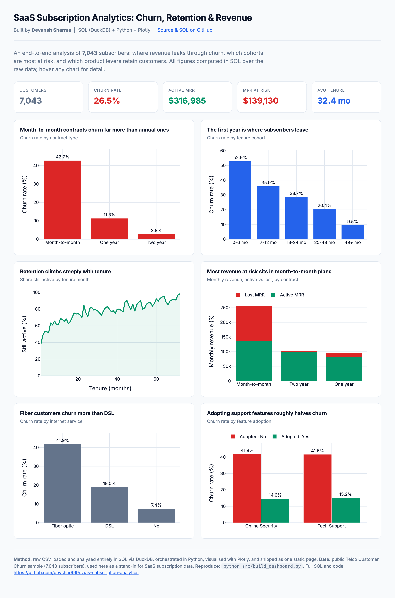

# SaaS Subscription Analytics: Churn, Retention & Revenue

An end-to-end analytics project on **7,043 subscribers**: where recurring revenue
leaks through churn, which cohorts are most at risk, and which product levers keep
customers. The analysis runs in **SQL (DuckDB)** over the raw data, is orchestrated
in **Python**, and ships as a single **interactive Plotly dashboard** that hosts for
free on GitHub Pages.

**Live dashboard:** https://devshar999.github.io/saas-subscription-analytics/
**The SQL:** [`sql/queries.sql`](sql/queries.sql) · **Build script:** [`src/build_dashboard.py`](src/build_dashboard.py)



## Business question
For a subscription business, retaining a customer is far cheaper than acquiring one.
This project answers three questions a BizOps or analytics team would actually ask:
1. **How much monthly revenue is at risk**, and where does it sit?
2. **When and who** churns most (contract type, tenure cohort, product line)?
3. **Which product levers** actually reduce churn?

## Key findings
- **26.5% overall churn**, putting **$139,130 of monthly recurring revenue at risk**
  against **$316,985** in active MRR.
- **Contract type is the biggest lever:** month-to-month plans churn at **42.7%**
  versus **2.8%** on two-year contracts.
- **Churn is front-loaded:** roughly **half** of customers in their first six months
  leave; retention climbs steeply with tenure.
- **Support features retain:** customers who adopt Tech Support or Online Security
  churn at roughly **half** the rate of those who do not.
- **Fiber optic customers churn more than DSL**, flagging a service-experience issue
  worth investigating.

## What this demonstrates
- **SQL:** typed views, conditional aggregation, cohorting with `CASE`, `TRY_CAST`
  for dirty fields, `UNION ALL` (see [`sql/queries.sql`](sql/queries.sql)).
- **Python:** a clean, reproducible build pipeline.
- **Data visualization:** an interactive, responsive dashboard with KPI cards and
  insight-led chart titles, no server required.

## Run it yourself
```bash
python -m venv .venv && source .venv/bin/activate
pip install -r requirements.txt
python src/build_dashboard.py      # writes docs/index.html
```

## Tools
DuckDB · pandas · Plotly · Python

## Data
Public **Telco Customer Churn** sample (7,043 subscribers), used as a stand-in for
SaaS subscription data. This is a well-known teaching dataset; the value here is the
analysis and the shippable dashboard, not the raw file.
